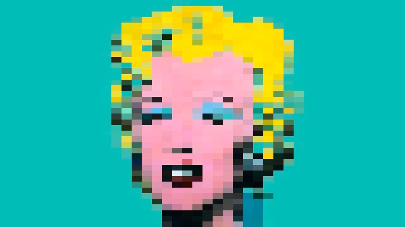

# MarilyNFT
<small>With this repo I'm making and deploying my own NFT Collection</small>

👩‍🎤 Limited Collection 👩‍🎤

[Project White Paper](https://www.canva.com/design/DAFHsj5CCj0/Qbv2soFjhUL2sYueWlcJ-g/view?utm_content=DAFHsj5CCj0&utm_campaign=designshare&utm_medium=link&utm_source=publishsharelink#1)

```
"A wise girl knows her limits, a smart girl knows that she has none."
            Marilyn Monroe
```
Marilyn is an NFT collection created by digital engineer who works as an Artist.

Marilyn is a tiny pixel art collection based on the famous Andy Warhol's painting.

This NFT project is similar to other collectibles such as Pokemon cards and fine art.

Note: this collection does not have any utility nor do I have any control over the prices on the secondary market (reseller's prices)

